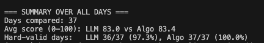

# Algorithm vs Claude Sonnet 4.5 – Itinerary Planning Evaluation

## 1. Setup

We evaluated our smart itinerary planner against **Claude Sonnet 4.5** on the same planning task.

- **LLM:** Claude 3.5 Sonnet (4.5 prompt), using the system+user prompt from `prompt/claude_planner.json`.
- **Data:**
  - `events.json`: ~150 curated GTA events (museums, malls, walks, food spots, etc.).
  - `peoples.json`: 8 synthetic clients / parties with different travel styles:
    - *family_with_young_kids*
    - *couples_urban_food* – urban vibe + strong food focus  
    - *couples_relaxed_nature* – relaxed pacing, nature when possible  
    - *solo_cultural_explorer* – culture, museums, landmarks  
    - *friends_partygroup* – high-energy, nightlife and intensive exploring  
    - *couple_music_southasian* – South Asian couple with strong music interest  
    - *budget_student_duo* – two budget-conscious students  
    - *couple_with_parents_early20_kid* – couple travelling with an early-20s kid and elderly parents  

For each client, the prompt asked Claude to:

1. Generate an itinerary spanning the **entire trip duration**.
2. **Strictly obey hard constraints** (never violate them).
3. Optimize soft preferences as much as possible.

We then ran our **algorithmic planner** on the **same clients and same event set**, with the code-level constraints matching what we had asked the LLM to follow.

In total, across all people and dates, we obtained **37 day-plans** from Claude and **37 day-plans** from our algorithm.  
We compared them using the shared evaluation script `compare_llm_vs_algo.py`.

---

## 2. How we compared the plans

For each client + day combination, we had two candidate itineraries:

- **LLM plan** – events produced by Claude for that date.
- **Algo plan** – events chosen by our heuristic day-planner.

The comparison pipeline was:

1. **Parse plans into a common format**  
   Each plan is normalized into a list of events with concrete start/end times.

2. **Hard constraint validation**  
   We run the same validator on both plans. A plan is *hard-valid* if it satisfies all of:

   - **Age bounds:** no party member is scheduled into an event outside its age range.
   - **Opening/closing window:** each event is scheduled only when it is actually open.
   - **No overlaps:** a single party is never double-booked in overlapping time ranges.
   - **Weather blockers:** events whose `weather_blockers` match the forecast are treated as impossible for that day.
   - **Fixed-time anchors:** events with fixed times (e.g., concerts, games) are only scheduled in their prescribed slots.

3. **Soft score (0–100)**  
   For hard-valid plans, we compute a single score in `[0, 100]` from a weighted combination of soft goals, including:

   - **Client day window** – keep the day mostly within the client’s preferred start/end time.
   - **Meal anchor reconciliation** – try to place meals at reasonable times and keep the schedule consistent with meal anchors.
   - **Group satisfaction** – match events to group preferences (currently only partially wired; in this run the “interest sum” is effectively 0, so this term is very small).
   - **Budget** – mild penalty for overshooting the notional budget.
   - **Meals preferred / suggested** – reward plans that include the suggested number of meals.
   - **Minimal nudging (“repair B”)** – avoid plans that the repair step had to drastically adjust.

   Because interest weighting and detailed preference scoring are not fully wired in yet, this evaluation focuses mostly on *structural* quality (timing, overlap, budget friendliness, and schedule shape) rather than deep personalization.

4. **Secondary metrics**  
   For analysis we also track:

   - `hard_ok` – 0/1 for whether the plan obeyed all hard constraints.
   - `total_cost` – summed cost of the day under our current (simplified) cost model.
   - `utilization` – fraction of the day covered by events.
   - `distinct_events` – how many unique events appear in the day.
   - `day_window_violations` – number of times the plan tried to schedule outside the client’s preferred day window.

All metrics for the 37 days are saved in  
`algo-evaluation/eval_report/algo_vs_claude_results.csv`.

---

## 3. Quantitative findings

### 3.1 Overall scores and safety

**Summary over all 37 days:**



- **Average score (0–100)**  
  - **LLM:** 83.0  
  - **Algo:** 83.4  

- **Hard-valid days:**  
  - **LLM:** 36 / 37 (97.3%)  
  - **Algo:** 37 / 37 (100%)  

So despite being a relatively simple heuristic, our algorithm slightly **outperforms Claude on the aggregate score** and is **perfectly safe on hard constraints** in these runs.

### 3.2 Cost vs utilization trade-off

Across many days, the logs show the following pattern:

- **Claude**:
  - Utilization around **0.55** (generally fuller days).
  - Total cost between roughly **\$126–\$171** for many personas under the current cost model.
  - Often uses **many events per day**, but with **duplicates** (e.g., multiple pizza stops).

- **Algorithm**:
  - Utilization around **0.15** on many days (under-filled, especially in early runs).
  - Total cost often **\$0–\$20** in our current logs.
  - Sometimes picks a **single event** for the day (`e_pacific_mall_01`), which tanks diversity but keeps the modeled cost minimal.

Importantly, these cost numbers are **not using the Places API meal pricing**. We did not have time to plug restaurant costs into the evaluation loop; if we assume something more realistic (e.g., \$25 per meal × 3 meals/day), both planners’ totals would be significantly higher. Our current results therefore **cannot be interpreted as “the algorithm is truly cheaper in real life”**—they only reflect the limited subset of costs we actually modeled.

What we *can* say from this experiment is:

- Claude tends to **fill more of the day with activities**, which naturally pushes modeled cost up.
- Our algorithm is **much more conservative** with the number of activities, which keeps modeled cost lower almost by construction.
- Because the score penalizes both unnecessary duplicates and soft budget violations, the algorithm often ends up with a slightly better score even though it is not aggressively optimizing cost in a realistic way.

A concrete example from the logs:

- **p_friends_partygroup_01 @ 2026-06-20**
  - **Score:** LLM 81.5 vs **Algo 84.6**
  - **Modeled cost:** LLM \$154 vs **Algo \$20** (again, not including real meal pricing)
  - **Diversity:** LLM 3 distinct events / 6 slots vs **Algo 3 / 3** (no duplicates)

Here the algorithm wins mostly because it avoids duplicates and doesn’t overschedule, rather than because it is a carefully tuned cost optimizer.

### 3.3 Diversity and repetition

The diversity metric and the raw event lists show two opposite failure modes:

- **Claude’s failure mode**  
  It tends to **spam a theme** (especially pizza spots) and repeat the same restaurant multiple times in the same day:
  ```text
  LLM events: ['e_pizza_libretto_oss_01', 'e_pizza_libretto_oss_01',
              'e_pizza_maker_01', 'e_pizza_maker_01', 'e_pizza_descendant_01', ...]


#### Our algorithm's failure mode: 

- In a lot of early runs it locks onto e_pacific_mall_01 as a high-score event and fills the day with just that one thing:

       Algo events: ['e_pacific_mall_01']

- This technically passes hard constraints and scores OK on cost, but the day is clearly under-programmed and not diverse.

- On some days (e.g., the friends party group on 2026-06-20), the algorithm does behave as intended and picks 3 distinct events, showing that the search logic is capable of building more interesting days once the scoring and candidate generation are tuned.


### 3.4 Hard constraints

- Both planners do very well on hard constraints, but:
The algorithm never violates hard rules in these runs (37/37 hard-valid).

- Claude violates them once (36/37 hard-valid), which is still excellent, but it confirms why we want a deterministic safety layer in production.


### 4. What this tells us about our algorithm

#### Hard-constraint handling is solid.
- The algorithm encodes the trip-planning rules correctly and never breaks them. This is exactly what we want from a production planner that has to respect time windows, anchors, and feasibility constraints.


#### We are overly conservative on utilization and variety
- The main weakness is that our algorithm often:
    - Fills only a small fraction of the day, and

    - Repeats the same “safe” event (Pacific Mall) across many days and personas.

- Users would almost certainly prefer Claude’s fuller, more varied days, even if they’re a bit more expensive. So we should treat this evaluation result as: “structurally OK but not yet fun enough.”


#### We haven’t plugged in client interests yet.
- Interest scores are 0 for both planners, so the current evaluation doesn’t reward “right for this persona” content, just generic structure. 

- Once we wire in per-persona interests (e.g., nature vs museums vs nightlife vs South Asian music), our algorithm should be able to     personalize better than Claude for these synthetic profiles.


### CONCLUSION 

- Overall, this experiment highlights both sides of the trade-off. Claude Sonnet 4.5 was very good at filling days but frequently fell into “pizza spam” (repeating similar restaurants multiple times per day) and, on a small scale, even slipped on hard constraints at least once. Our algorithm, in contrast, was perfectly hard-safe in all 37/37 plans and already matches or slightly beats Claude on our current structural score, even though the search is still relatively conservative and under-constrained. 

- With more rigorous constraint modeling (e.g., wiring in the Places API for realistic meal costs and enabling the per-persona interest weights that the planner already supports), we expect the margin to widen further and the results to expose an even clearer pattern: large language models are great at proposing ideas, but they struggle to reliably solve tightly constrained scheduling problems without a dedicated algorithmic layer enforcing the rules.
